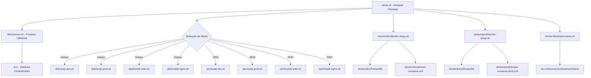
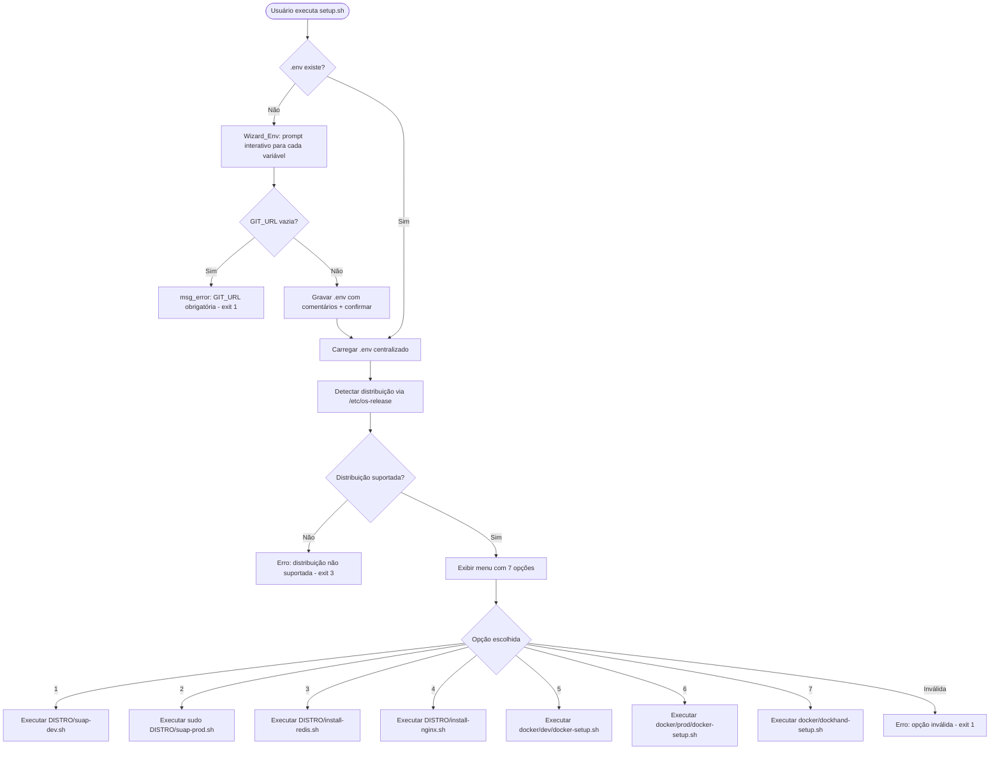
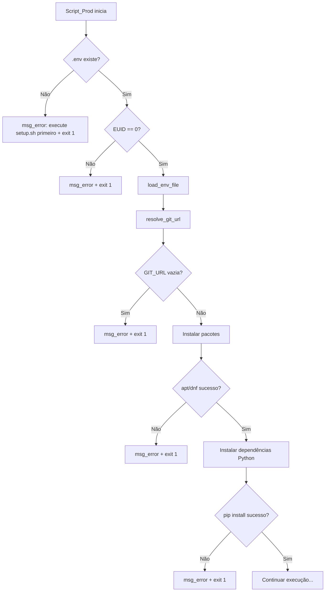

# Design Document

## Overview

Este documento descreve o design técnico do projeto **suap-setup**, uma coleção de scripts shell que automatizam a configuração do ambiente da aplicação SUAP em sistemas Linux. O sistema é composto por um wrapper principal (`setup.sh`) que detecta a distribuição, exibe um menu interativo e delega a execução para scripts especializados por família de distribuição (Debian/RPM) e por tipo de ambiente (dev/prod/Docker).

### Decisões de Design

1. **Arquivo `.env` centralizado**: Todas as variáveis compartilhadas são lidas de um único arquivo na raiz do repositório, eliminando duplicação entre scripts.
2. **Funções utilitárias em `lib/common.sh`**: Lógica compartilhada (carregamento de .env, detecção de distro, output colorido, verificações idempotentes, wizard interativo) é extraída para um arquivo de biblioteca sourced por todos os scripts.
3. **Separação por família de distribuição**: Scripts em `deb/` e `rpm/` contêm apenas lógica específica do gerenciador de pacotes.
4. **Docker como alternativa isolada**: Ambientes Docker não dependem de scripts deb/rpm — possuem Dockerfiles e compose files próprios.
5. **Idempotência por verificação prévia**: Cada etapa verifica o estado antes de agir, usando cores diferentes para ações executadas vs. puladas.
6. **Wizard interativo para .env**: Na primeira execução do wrapper, um assistente interativo (`interactive_env_wizard`) guia o usuário pela criação do .env com prompts descritivos, defaults e validação de campos obrigatórios — substituindo a criação silenciosa com valores padrão.
7. **Fallback de .env em scripts individuais**: Scripts executados diretamente (sem wrapper) abortam com erro se .env não existe, evitando execução parcial sem configuração.
8. **Halt imediato em falhas críticas**: Falhas em instalação de pacotes (apt/dnf) e dependências Python (uv/pip) resultam em exit 1 imediato, evitando ambientes em estado inconsistente.

## Architecture

### Diagrama de Componentes



### Fluxo de Execução Principal



## Components and Interfaces

### 1. Biblioteca Compartilhada (`lib/common.sh`)

Módulo central com funções utilitárias reutilizáveis por todos os scripts.

```bash
#!/usr/bin/env bash
# lib/common.sh - Funções utilitárias compartilhadas

# --- Carregamento de variáveis ---

# load_env_file(env_path)
# Carrega variáveis do arquivo .env centralizado.
# Parâmetros: caminho absoluto do .env
# Retorno: exporta variáveis como variáveis de shell
# Comportamento:
#   - Quando chamada pelo wrapper (setup.sh): se .env não existe, invoca interactive_env_wizard()
#   - Quando chamada por scripts individuais (suap-dev.sh, suap-prod.sh, docker-setup.sh):
#     se .env não existe, exibe msg_error e exit 1 (fallback — scripts individuais não
#     executam o wizard, exigem que o wrapper tenha sido executado antes)
# Exit 1 se o arquivo não existir (modo individual) ou se variáveis obrigatórias faltarem
load_env_file() { ... }

# require_env_file(env_path)
# Verifica se o .env existe; caso contrário, exibe erro e aborta.
# Usado pelos scripts individuais que NÃO devem iniciar o wizard.
# Exit 1 se o arquivo não existir
require_env_file() { ... }

# interactive_env_wizard(env_path)
# Assistente interativo para criação do .env na primeira execução pelo wrapper.
# Solicita ao usuário: PYTHON_VERSION, BASE_DIR, SUAP_DIR, VENV_DIR, GIT_URL.
# Para cada variável:
#   - Exibe nome, descrição do propósito, exemplos e valor padrão (dev)
#   - Se o usuário pressiona Enter sem digitar → usa valor padrão
# Exceção: GIT_URL não possui valor padrão → exit 1 se vazia
# Após coleta, grava o .env com comentários descritivos e exibe confirmação.
# Parâmetros: caminho absoluto onde criar o .env
# Exit 1 se GIT_URL vazia
interactive_env_wizard() { ... }

# resolve_git_url(env_path)
# Lê GIT_URL do .env ou solicita ao usuário via prompt interativo.
# Persiste o valor informado no .env para uso futuro.
# Parâmetros: caminho do .env
# Retorno: exporta GIT_URL
# Exit 1 se URL informada estiver vazia
resolve_git_url() { ... }

# --- Detecção de Distribuição ---

# detect_distro()
# Lê /etc/os-release e classifica em "deb" ou "rpm".
# Retorno: define DISTRO_TYPE ("deb"|"rpm") e DISTRO_NAME
# Exit 3 se /etc/os-release não existe ou distro não suportada
detect_distro() { ... }

# get_supervisor_conf_dir()
# Retorna o diretório de configuração do Supervisor baseado na distro.
# Retorno: "/etc/supervisor/conf.d" (Debian) ou "/etc/supervisord.d" (RPM)
get_supervisor_conf_dir() { ... }

# get_nginx_conf_path()
# Retorna o caminho de destino da configuração do Nginx.
# Retorno: varia por distro (sites-available vs conf.d)
get_nginx_conf_path() { ... }

# --- Output Colorido ---

# Constantes de cor
GREEN=$(tput setaf 2)
YELLOW=$(tput setaf 3)
RED=$(tput setaf 1)
NO_COLOR=$(tput sgr0)

# msg_action(mensagem)
# Exibe mensagem em verde (ação sendo executada)
msg_action() { echo "${GREEN}>>> $1 ${NO_COLOR}"; }

# msg_skip(mensagem)
# Exibe mensagem em amarelo (etapa já concluída)
msg_skip() { echo "${YELLOW}>>> $1 ${NO_COLOR}"; }

# msg_error(mensagem)
# Exibe mensagem em vermelho (erro)
msg_error() { echo "${RED}ERRO: $1 ${NO_COLOR}"; }

# --- Verificações Idempotentes ---

# is_pkg_installed(pkg_name)
# Verifica se um pacote está instalado.
# Usa dpkg (Debian) ou rpm (RPM) conforme DISTRO_TYPE.
# Retorno: 0 se instalado, 1 caso contrário
is_pkg_installed() { ... }

# check_all_packages_installed(pkg_list)
# Verifica se todos os pacotes da lista estão instalados.
# Retorno: 0 se todos instalados, 1 se algum faltando
check_all_packages_installed() { ... }

# --- Verificação de Pré-requisitos Docker ---

# check_docker_available()
# Verifica se Docker e Docker Compose estão instalados.
# Exit 1 com mensagem de erro se não disponíveis
check_docker_available() { ... }
```

### 2. Wrapper Principal (`setup.sh`)

```bash
#!/usr/bin/env bash
set -u
# setup.sh - Ponto de entrada principal

# Algoritmo:
# 1. Determinar SCRIPT_DIR (diretório raiz do repositório)
# 2. Source lib/common.sh
# 3. Verificar se .env existe:
#    - Se não: executar interactive_env_wizard() (Requirement 28)
#    - Se sim: carregar com load_env_file()
# 4. Detectar distribuição (detect_distro)
# 5. Exibir menu com 7 opções
# 6. Validar entrada e executar script correspondente
# 7. Verificar existência do script antes de executar

# Mapeamento opção → script:
# 1 → ${DISTRO_TYPE}/suap-dev.sh
# 2 → ${DISTRO_TYPE}/suap-prod.sh (com sudo)
# 3 → ${DISTRO_TYPE}/install-redis.sh
# 4 → ${DISTRO_TYPE}/install-nginx.sh
# 5 → docker/dev/docker-setup.sh
# 6 → docker/prod/docker-setup.sh
# 7 → docker/dockhand-setup.sh
```

### 3. Scripts de Desenvolvimento (`deb/suap-dev.sh`, `rpm/suap-dev.sh`)

```bash
#!/bin/bash
set -u
# Algoritmo sequencial do script de desenvolvimento:
#
# 1. Source lib/common.sh
# 2. require_env_file() - falha com exit 1 se .env não existe (fallback individual)
# 3. load_env_file() - carregar variáveis centralizadas
# 4. resolve_git_url() - garantir GIT_URL disponível
# 5. Verificar e instalar dependências do sistema (check_all_packages_installed)
#    - Se apt/dnf falha → exit 1 (Requirement 5.3)
# 6. Configurar locale pt_BR.UTF-8 (se necessário)
# 7. Configurar timezone America/Fortaleza (se necessário)
# 8. Instalar UV:
#    a. Verificar se `uv` está no PATH → pular se sim
#    b. Verificar locais conhecidos (~/.cargo/bin/uv, ~/.local/bin/uv) → adicionar ao PATH se encontrado
#    c. Se não encontrado → baixar e instalar da URL oficial
# 9. Clone/pull do repositório SUAP
# 10. Gerar settings.py e .env (se não existem)
# 11. Instalar Python via UV (se não disponível)
# 12. Criar virtualenv (se não existe)
# 13. Instalar/atualizar dependências Python
#     - Se uv sync / uv pip install falha → exit 1 (Requirement 10.7)
# 14. Exibir mensagem final com próximos passos

# Diferenças entre deb e rpm:
# - Lista de pacotes (nomes variam por distro)
# - Comando de instalação (apt vs dnf)
# - Comando de locale (update-locale vs localectl)
# - Verificação de pacote (dpkg vs rpm -q)
```

### 4. Scripts de Produção (`deb/suap-prod.sh`, `rpm/suap-prod.sh`)

```bash
#!/bin/bash
set -u
# Algoritmo sequencial do script de produção:
#
# 1. Source lib/common.sh
# 2. require_env_file() - falha com exit 1 se .env não existe (fallback individual)
# 3. load_env_file() - carregar variáveis centralizadas
# 4. Validar execução como root (exit 1 se EUID != 0)
# 5. resolve_git_url() - garantir GIT_URL disponível
# 6. Verificar e instalar dependências do sistema
#    - Se apt/dnf falha → exit 1 (Requirement 11.3)
# 7. Configurar locale e timezone
# 8. Clone/pull do código SUAP (com --depth 1)
# 9. Gerar settings.py e .env (se não existem)
# 10. Criar virtualenv com python3 -m venv (se não existe)
# 11. Instalar/atualizar dependências via pip
#     - Se pip install falha → exit 1 (Requirement 14.6)
# 12. Menu do Supervisor (SUAP / Celery / Ambos)
# 13. Copiar configs e runners para diretório do Supervisor
#     - Rastrear flag: FILES_COPIED=true se pelo menos um arquivo foi copiado
# 14. Condicionalmente executar supervisorctl:
#     - Se FILES_COPIED=true: executar `supervisorctl reread && supervisorctl update`
#     - Se FILES_COPIED=false (idempotência): pular supervisorctl
# 15. Ajustar permissões (chown www-data)
# 16. Exibir mensagem final com próximos passos

# Diferenças entre deb e rpm:
# - Lista de pacotes de produção
# - Diretório do Supervisor (/etc/supervisor/conf.d vs /etc/supervisord.d)
# - Comando de locale
# - Serviço supervisor (supervisor vs supervisord)
```

### 5. Scripts Docker (`docker/dev/docker-setup.sh`, `docker/prod/docker-setup.sh`)

```bash
#!/usr/bin/env bash
set -u
# Algoritmo do script Docker dev:
#
# 1. Source lib/common.sh
# 2. require_env_file() - falha com exit 1 se .env não existe (fallback individual)
# 3. load_env_file()
# 4. check_docker_available() - exit 1 se Docker não disponível
# 5. resolve_git_url()
# 6. msg_action() para mensagens de progresso em verde
# 7. docker compose up --build
# 8. Exibir mensagem com URL de acesso e comandos úteis

# Algoritmo do script Docker prod:
#
# 1. Source lib/common.sh
# 2. require_env_file() - falha com exit 1 se .env não existe (fallback individual)
# 3. load_env_file()
# 4. check_docker_available() - exit 1 se Docker não disponível
# 5. resolve_git_url()
# 6. msg_action() para mensagens de progresso em verde
# 7. docker compose -f docker-compose.prod.yml up -d --build
# 8. docker compose -f docker-compose.prod.yml ps
# 9. Exibir status dos serviços e instruções de gerenciamento
```

### 6. Scripts de Redis e Nginx

Os scripts de Redis e Nginx seguem padrão simples:

```bash
# install-redis.sh (deb/rpm):
# 1. Source lib/common.sh
# 2. msg_action() para mensagens de progresso em verde
# 3. Instalar pacote (redis-server no Debian, redis no RPM)
# 4. systemctl start + enable
# 5. Exibir status

# install-nginx.sh (deb/rpm):
# 1. Source lib/common.sh
# 2. msg_action() para mensagens de progresso em verde
# 3. Instalar pacote nginx
# 4. systemctl start + enable
# 5. Copiar configuração para local correto (get_nginx_conf_path)
#    - Debian: /etc/nginx/sites-available/suap + link em sites-enabled
#    - RPM: /etc/nginx/conf.d/suap.conf
# 6. Remoção condicional da config default (Debian only):
#    - Somente APÓS a configuração do SUAP ser copiada com sucesso
#      E o link simbólico em sites-enabled/suap ser criado com sucesso
#    - Se a etapa 5 foi pulada por idempotência, NÃO remove o default
# 7. nginx -t (testar configuração)
# 8. systemctl reload nginx
# 9. Exibir mensagem sobre configuração de IPs
```

### 7. Script Dockhand (`docker/dockhand-setup.sh`)

```bash
#!/usr/bin/env bash
set -u
# Algoritmo do script Dockhand:
#
# 1. Source lib/common.sh
# 2. check_docker_available() - exit 1 se Docker não disponível
# 3. Definir DOCKHAND_PORT a partir de configuração (padrão: 9093)
# 4. Verificar se já existe container "dockhand" em execução
#    - Se sim: exibir mensagem informando que já está ativo + URL de acesso
#             (usando porta efetivamente configurada)
#    - Se não: continuar para pull e start
# 5. msg_action() para mensagens de progresso em verde
# 6. docker pull lscr.io/linuxserver/dockhand:latest
# 7. docker run -d \
#      --name dockhand \
#      -p ${DOCKHAND_PORT}:3000 \
#      -v /var/run/docker.sock:/var/run/docker.sock \
#      --restart unless-stopped \
#      lscr.io/linuxserver/dockhand:latest
# 8. Verificar se o container iniciou com sucesso
#    - Se falhou: exibir msg_error com motivo + exit 1
#    - Se sucesso: exibir URL de acesso (http://localhost:${DOCKHAND_PORT})
```

**Decisões de Design para o Dockhand:**

- **Imagem**: `lscr.io/linuxserver/dockhand:latest` — mantém sempre a versão mais recente do LinuxServer.
- **Porta dinâmica**: A porta é configurável via variável `DOCKHAND_PORT` (padrão 9093). A mensagem final exibe a URL com a porta efetivamente usada (não hardcoded).
- **Docker Socket**: Montagem de `/var/run/docker.sock` é obrigatória para que o Dockhand consiga gerenciar os containers do host.
- **Idempotência**: Antes de criar o container, verifica se já existe um com nome "dockhand" em execução. Se existir, apenas informa o status.
- **Restart policy**: `unless-stopped` garante que o Dockhand reinicia automaticamente após reboot do host.
- **Reuso de `check_docker_available()`**: Reutiliza a função já existente em `lib/common.sh` para validar pré-requisitos Docker.
- **Mensagens em verde**: Usa `msg_action()` para progresso visual consistente com os demais scripts.

## Data Models

### Arquivo `.env` Centralizado

```ini
# =============================================================
# Configuração centralizada do suap-setup
# Edite este arquivo conforme seu ambiente
# =============================================================

# Versão do Python a ser utilizada
PYTHON_VERSION=3.12

# Diretório base para instalação
# Desenvolvimento: $HOME/Projetos
# Produção: /opt
BASE_DIR=/opt

# Diretório onde o código SUAP será clonado
SUAP_DIR=${BASE_DIR}/suap

# Diretório do virtualenv
# Desenvolvimento: ${SUAP_DIR}/.venv
# Produção: /opt/venv/suap
VENV_DIR=${BASE_DIR}/venv

# URL do repositório Git do SUAP
GIT_URL=
```

### Estrutura de Diretórios do Projeto (após refatoração)

```
suap-setup/
├── .env                          # Variáveis centralizadas
├── setup.sh                      # Wrapper principal (renomeado)
├── lib/
│   └── common.sh                 # Funções utilitárias compartilhadas
├── deb/
│   ├── suap-dev.sh              # Dev - Debian
│   ├── suap-prod.sh             # Prod - Debian
│   ├── install-redis.sh         # Redis - Debian
│   └── install-nginx.sh         # Nginx - Debian
├── rpm/
│   ├── suap-dev.sh              # Dev - RPM
│   ├── suap-prod.sh             # Prod - RPM
│   ├── install-redis.sh         # Redis - RPM
│   └── install-nginx.sh         # Nginx - RPM
├── docker/
│   ├── dev/
│   │   ├── Dockerfile           # Imagem dev
│   │   ├── docker-compose.yml   # Compose dev
│   │   └── docker-setup.sh      # Script de setup Docker dev
│   ├── prod/
│   │   ├── Dockerfile           # Imagem prod (multi-stage)
│   │   ├── docker-compose.prod.yml  # Compose prod
│   │   └── docker-setup.sh      # Script de setup Docker prod
│   └── dockhand-setup.sh        # Script de setup Dockhand
├── nginx/
│   └── suap                     # Configuração Nginx proxy reverso
├── supervisor/
│   ├── suap.conf
│   ├── run_suap.sh
│   ├── celery_worker.conf
│   ├── run_celery_worker.sh
│   ├── celery_beat.conf
│   ├── run_celery_beat.sh
│   ├── celery_flower.conf
│   └── run_celery_flower.sh
└── README.md
```

### Docker Compose - Desenvolvimento (`docker/dev/docker-compose.yml`)

```yaml
# Serviços:
services:
  suap:
    build:
      context: ../..
      dockerfile: docker/dev/Dockerfile
    ports:
      - "8000:8000"
    volumes:
      - ../../:/app  # Código-fonte montado para hot-reload
    env_file:
      - ../../.env
    depends_on:
      - db
      - redis
    command: uv run python manage.py runserver 0.0.0.0:8000

  db:
    image: postgres:16
    environment:
      POSTGRES_DB: suap
      POSTGRES_USER: suap
      POSTGRES_PASSWORD: suap
    volumes:
      - pgdata:/var/lib/postgresql/data
    ports:
      - "5432:5432"

  redis:
    image: redis:7-alpine
    ports:
      - "6379:6379"

volumes:
  pgdata:
```

### Docker Compose - Produção (`docker/prod/docker-compose.prod.yml`)

```yaml
# Serviços:
services:
  suap:
    build:
      context: ../..
      dockerfile: docker/prod/Dockerfile
    env_file:
      - ../../.env
    depends_on:
      - redis
    restart: unless-stopped
    volumes:
      - static:/opt/suap/deploy/static
      - media:/opt/suap/deploy/media
      - logs:/opt/logs

  celery-worker:
    build:
      context: ../..
      dockerfile: docker/prod/Dockerfile
    command: celery -A suap worker -l info
    env_file:
      - ../../.env
    depends_on:
      - redis
    restart: unless-stopped
    volumes:
      - logs:/opt/logs

  celery-beat:
    build:
      context: ../..
      dockerfile: docker/prod/Dockerfile
    command: celery -A suap beat -l info
    env_file:
      - ../../.env
    depends_on:
      - redis
    restart: unless-stopped

  celery-flower:
    build:
      context: ../..
      dockerfile: docker/prod/Dockerfile
    command: celery -A suap flower
    env_file:
      - ../../.env
    depends_on:
      - redis
    restart: unless-stopped
    ports:
      - "5555:5555"

  redis:
    image: redis:7-alpine
    restart: unless-stopped

  nginx:
    image: nginx:alpine
    ports:
      - "80:80"
      - "8001:8001"
    volumes:
      - ../../nginx/suap:/etc/nginx/conf.d/default.conf:ro
      - static:/opt/suap/deploy/static:ro
      - media:/opt/suap/deploy/media:ro
      - logs:/opt/logs/nginx
    depends_on:
      - suap
    restart: unless-stopped

volumes:
  static:
  media:
  logs:
  pgdata:
```

### Tabela de Roteamento do Wrapper

| Opção | Distro | Script Executado                    | Sudo |
|-------|--------|-------------------------------------|------|
| 1     | deb    | `deb/suap-dev.sh`                   | Não  |
| 1     | rpm    | `rpm/suap-dev.sh`                   | Não  |
| 2     | deb    | `deb/suap-prod.sh`                  | Sim  |
| 2     | rpm    | `rpm/suap-prod.sh`                  | Sim  |
| 3     | deb    | `deb/install-redis.sh`              | Não  |
| 3     | rpm    | `rpm/install-redis.sh`              | Não  |
| 4     | deb    | `deb/install-nginx.sh`              | Não  |
| 4     | rpm    | `rpm/install-nginx.sh`              | Não  |
| 5     | *      | `docker/dev/docker-setup.sh`        | Não  |
| 6     | *      | `docker/prod/docker-setup.sh`       | Não  |
| 7     | *      | `docker/dockhand-setup.sh`          | Não  |

### Tabela de Caminhos por Distribuição

| Recurso              | Debian                              | RPM                        |
|----------------------|-------------------------------------|----------------------------|
| Supervisor conf      | `/etc/supervisor/conf.d/`           | `/etc/supervisord.d/`      |
| Nginx config         | `/etc/nginx/sites-available/suap`   | `/etc/nginx/conf.d/suap.conf` |
| Nginx enabled link   | `/etc/nginx/sites-enabled/suap`     | N/A (conf.d auto-loaded)   |
| Serviço Redis        | `redis-server`                      | `redis`                    |
| Serviço Supervisor   | `supervisor`                        | `supervisord`              |
| Verificação pacote   | `dpkg -l \| grep "^ii  PKG"`       | `rpm -q PKG`              |
| Instalador           | `apt install -y`                    | `dnf install -y`           |
| Locale               | `update-locale LANG=pt_BR.UTF-8`   | `localectl set-locale LANG=pt_BR.UTF-8` |

## Correctness Properties

*Uma propriedade é uma característica ou comportamento que deve ser verdadeiro em todas as execuções válidas de um sistema — essencialmente, uma declaração formal sobre o que o sistema deve fazer. Propriedades servem como ponte entre especificações legíveis por humanos e garantias de corretude verificáveis por máquina.*

### Property 1: Round-trip do arquivo .env

*Para qualquer* conjunto de pares chave=valor válidos (sem caracteres especiais de shell não-escapados), escrever esses pares no arquivo `.env` e depois carregá-los com `load_env_file()` deve resultar em variáveis de shell com exatamente os mesmos valores originais.

**Validates: Requirements 1.2, 1.3, 1.4, 1.5, 4.1, 4.3, 4.5, 28.9**

### Property 2: Classificação de distribuição determina caminhos corretos

*Para qualquer* conteúdo válido de `/etc/os-release` onde `ID` ou `ID_LIKE` contenha identificadores de família Debian (debian, ubuntu) ou RPM (rhel, fedora, centos), a função `detect_distro()` deve classificar corretamente como "deb" ou "rpm", e as funções `get_supervisor_conf_dir()` e `get_nginx_conf_path()` devem retornar os caminhos correspondentes à família detectada.

**Validates: Requirements 2.1, 17.1, 17.2, 20.1, 20.3**

### Property 3: Roteamento do menu produz caminho de script correto

*Para qualquer* combinação válida de opção do menu (1-7) e tipo de distribuição detectada (deb/rpm), o wrapper deve construir o caminho correto do script de acordo com a tabela de roteamento, e opções fora do intervalo válido devem resultar em código de saída 1.

**Validates: Requirements 3.2, 3.3, 27.1**

### Property 4: Idempotência de execução

*Para qualquer* script (dev ou prod) executado duas vezes consecutivas no mesmo ambiente, o estado final do sistema após a segunda execução deve ser idêntico ao estado após a primeira execução, e a segunda execução deve exibir mensagens em amarelo (pulo) em vez de verde (ação) para todas as etapas já concluídas.

**Validates: Requirements 24.3, 24.4, 25.1, 25.2, 25.3, 25.4**

### Property 5: Idempotência do Dockhand

*Para qualquer* estado do sistema onde o container Dockhand já está em execução, executar o script `docker/dockhand-setup.sh` novamente deve resultar em uma mensagem informativa (sem criar um segundo container) e exibir a URL de acesso existente.

**Validates: Requirements 27.8**

### Property 6: Round-trip do Wizard_Env

*Para qualquer* conjunto de valores de entrada (PYTHON_VERSION, BASE_DIR, SUAP_DIR, VENV_DIR como strings não-vazias, e GIT_URL como string não-vazia), quando esses valores são fornecidos como stdin ao `interactive_env_wizard()`, o arquivo `.env` resultante, ao ser carregado com `load_env_file()`, deve produzir variáveis de shell com exatamente os mesmos valores fornecidos.

**Validates: Requirements 28.3, 28.4, 28.5, 28.6, 28.8, 28.9**

### Property 7: Fallback de .env em scripts individuais

*Para qualquer* script individual (Script_Dev, Script_Prod, Script_Docker_Dev, Script_Docker_Prod), quando executado diretamente em um ambiente onde o Arquivo_Env_Central não existe, o script deve encerrar com código de saída 1 sem realizar nenhuma operação de instalação ou configuração.

**Validates: Requirements 1.7**

### Property 8: Mensagens de progresso em verde para todos os scripts

*Para qualquer* script do sistema (Script_Dev, Script_Prod, Script_Redis, Script_Nginx, Script_Docker_Dev, Script_Docker_Prod, Wrapper), todas as mensagens de progresso de ações sendo executadas devem utilizar a sequência de cor verde (via `msg_action()`).

**Validates: Requirements 25.1, 25.3, 25.5, 25.6, 25.7, 25.8, 25.9**

## Error Handling

### Códigos de Saída

| Código | Significado                                    | Onde ocorre                    |
|--------|------------------------------------------------|--------------------------------|
| 0      | Sucesso                                        | Todos os scripts               |
| 1      | Erro de entrada/validação                      | URL vazia, opção inválida, falta pré-requisito |
| 1      | .env ausente (execução individual)             | Script_Dev, Script_Prod, Script_Docker sem wrapper |
| 1      | GIT_URL vazia no wizard                        | Wizard_Env (Requirement 28.7) |
| 1      | Falha na instalação de pacotes                 | apt/dnf retorna != 0 (Req. 5.3, 11.3) |
| 1      | Falha na instalação de dependências Python     | uv sync/pip install retorna != 0 (Req. 10.7, 14.6) |
| 2      | Script não encontrado                          | Wrapper (arquivo esperado ausente) |
| 3      | Distribuição não detectada/suportada           | Wrapper (detecção)             |

### Estratégias de Tratamento

1. **`set -u`**: Todos os scripts usam `set -u` para falhar em variáveis não definidas.
2. **Validação de pré-condições**: Cada script valida pré-condições no início (root para prod, Docker disponível para Docker, .env presente para scripts individuais).
3. **Mensagens de erro claras**: Todas as mensagens de erro usam `msg_error()` com cor vermelha e indicam a ação corretiva.
4. **Falha graceful em rede**: Scripts que dependem de rede (git clone, curl) propagam o erro do comando externo.
5. **Verificação de arquivos**: Antes de copiar configs do Supervisor/Nginx, verifica existência no diretório do repositório.
6. **Halt imediato em falhas de instalação**: Se `apt install` / `dnf install` falha, o script exibe erro e faz exit 1 imediatamente — não continua com dependências parciais.
7. **Halt imediato em falhas de dependências Python**: Se `uv sync` / `uv pip install` / `pip install` falha, o script exibe erro e faz exit 1.
8. **Fallback de .env em scripts individuais**: Scripts executados diretamente (sem o wrapper) verificam a existência do .env com `require_env_file()` e abortam com exit 1 se ausente, orientando o usuário a executar `setup.sh` primeiro.

### Fluxo de Erro - Exemplo



## Testing Strategy

### Abordagem

Dada a natureza do projeto (scripts shell com efeitos colaterais no sistema operacional), a estratégia de testes combina:

1. **Testes de propriedade (property-based)**: Para lógica pura extraída em funções — carregamento de .env, detecção de distro, roteamento de menu.
2. **Testes unitários (example-based)**: Para verificações de formato, conteúdo de arquivos gerados e mensagens de saída.
3. **Testes de integração em container**: Para validar fluxos completos de instalação em ambientes Docker isolados (Debian e Fedora).
4. **Testes de fumaça (smoke)**: Para verificar configurações estáticas (nginx/suap, docker-compose files).

### Framework de Teste

- **bats-core** (Bash Automated Testing System) para testes unitários e de integração
- **bats-assert** e **bats-support** como bibliotecas auxiliares
- Para testes de propriedade: **bats-core** com gerador customizado de inputs (loop com inputs aleatórios, mínimo 100 iterações)

### Configuração de Testes de Propriedade

- Cada teste de propriedade executa no mínimo **100 iterações** com inputs gerados aleatoriamente
- Cada teste referencia a propriedade do design via tag:
  - `# Feature: suap-setup, Property 1: Round-trip do arquivo .env`
  - `# Feature: suap-setup, Property 2: Classificação de distribuição`
  - `# Feature: suap-setup, Property 3: Roteamento do menu`
  - `# Feature: suap-setup, Property 4: Idempotência de execução`
  - `# Feature: suap-setup, Property 5: Idempotência do Dockhand`
  - `# Feature: suap-setup, Property 6: Round-trip do Wizard_Env`
  - `# Feature: suap-setup, Property 7: Fallback de .env em scripts individuais`
  - `# Feature: suap-setup, Property 8: Mensagens de progresso em verde`

### Estrutura de Testes

```
tests/
├── unit/
│   ├── test_load_env.bats        # Testes de carregamento .env (Property 1)
│   ├── test_detect_distro.bats   # Testes de detecção de distro (Property 2)
│   ├── test_menu_routing.bats    # Testes de roteamento do menu (Property 3)
│   ├── test_output_colors.bats   # Testes de saída colorida
│   ├── test_env_wizard.bats      # Testes do Wizard_Env (prompts, defaults, validação)
│   └── test_require_env.bats     # Testes do fallback require_env_file()
├── property/
│   ├── test_env_roundtrip.bats   # Property 1: round-trip .env
│   ├── test_distro_paths.bats    # Property 2: distro → paths
│   ├── test_routing.bats         # Property 3: opção + distro → script
│   ├── test_idempotency.bats     # Property 4 & 5: idempotência
│   ├── test_wizard_roundtrip.bats # Property 6: round-trip Wizard_Env
│   ├── test_env_fallback.bats    # Property 7: fallback .env em scripts individuais
│   └── test_green_messages.bats  # Property 8: mensagens de progresso em verde
├── integration/
│   ├── Dockerfile.debian         # Container Debian para testes
│   ├── Dockerfile.fedora         # Container Fedora para testes
│   ├── test_dev_debian.bats      # Fluxo dev completo (Debian)
│   ├── test_dev_rpm.bats         # Fluxo dev completo (RPM)
│   ├── test_prod_debian.bats     # Fluxo prod completo (Debian)
│   └── test_prod_rpm.bats        # Fluxo prod completo (RPM)
└── smoke/
    ├── test_nginx_config.bats    # Validação do arquivo nginx/suap
    ├── test_docker_compose.bats  # Validação dos docker-compose files
    ├── test_supervisor_confs.bats # Validação dos .conf do Supervisor
    └── test_docker.bats          # Validação do script Dockhand e Docker
```

### Execução

```bash
# Testes unitários e de propriedade (rápidos, sem dependências externas)
bats tests/unit/ tests/property/

# Testes de fumaça (validação estática de configs)
bats tests/smoke/

# Testes de integração (requerem Docker)
docker build -f tests/integration/Dockerfile.debian -t suap-test-deb .
docker run --rm suap-test-deb bats tests/integration/test_dev_debian.bats
```
